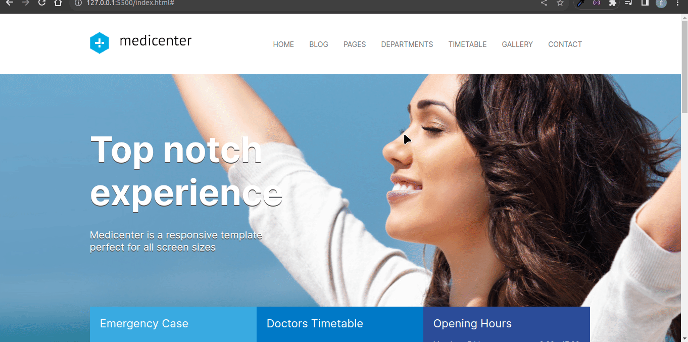
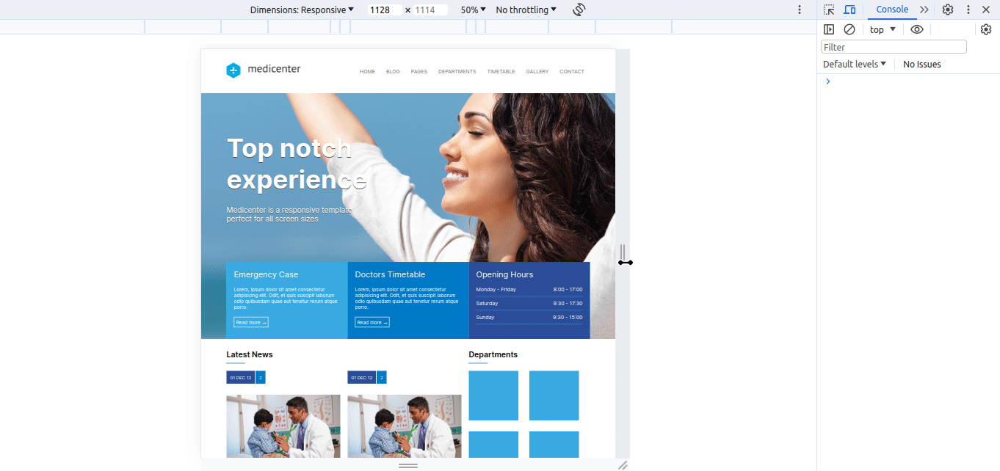

# Página com Flexbox Layout

Projeto feito durante o curso de HTML e CSS, com o intuíto de fixar os conceitos de Flexbox Layout. Além de flexível, está adaptado a diferentes telas.

## Tecnologias usadas:

- HTML
- CSS
